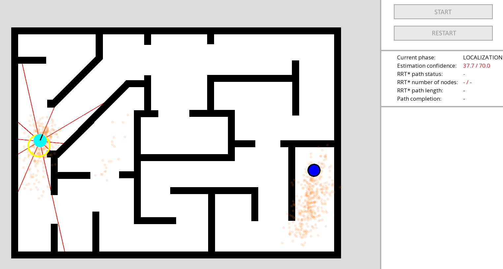
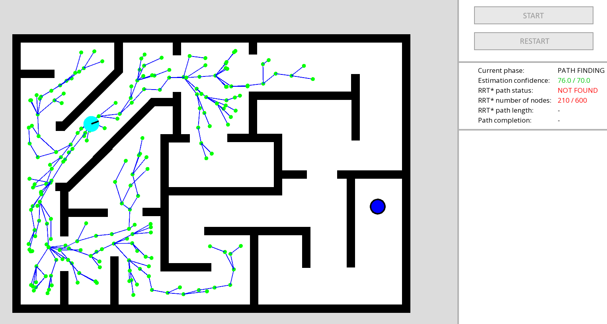
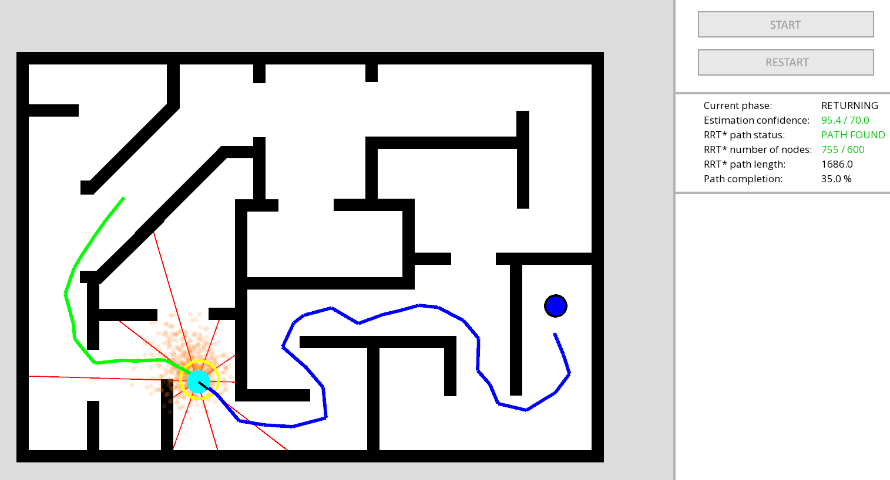

# Robot navigation simulation

Project implements particle filtering method (Monte Carlo) to estimate robot position inside building (map is known a priori). After estimating most probable robot position, RRT* algorithm is used to find the shortest path from current position to set home position (Blue node). After detecting the best path, robot goes into travelling mode, and moves from its current position to home while continuing to estimate its position with particle filtering. It is assumed that robot is equipped with Lidar sensor allowing him to collect data of distances between him and closest obstacle in 8 different directions.

## Screenshots

## How to use it?

### Requirements

* In order to build this application on your platform you need to have SFML installed (2.5.0 or newer version).

### Build

* Edit CMakeList.txt file, set SFML_DIR variable to path where you installed SFML library
* Create a build directory where you want executable file to be placed
* From inside this newly created directory use command 'cmake' with path to project root directory
* If your build system of choice is Makefile, also add '-G "Unix Makefiles"' argument
* Go to your build directory and build application with 'make' command (if your build system is Makefile)
* Executable file 'RobotNavigation.exe' will be created inside your build directory

Example:

'''
mkdir build
cd build
cmake .. -G "Unix Makefiles"
make
.\RobotNavigation.exe
'''

## What's inside?

Simulation workflow can split into 4 stages:

1. **SETUP** - Set robot starting position and goal/home position inside the building. To proceed to next stage user needs to press _START_ button.
2. **LOCALIZATION** - Robot drives around building in random direction and tries to estimate its current position using particle filtering (Monte Carlo algorithm). To proceed, estimation confidence level must hit required threshold of 70%. Time to do so may vary and is dependent on building structure, starting position and amount of Lidar beams available.
3. **PATH FINDING** - RRT* (Rapidly exploring random tree) algorithm is used to find the shortest path from current robot position to goal/home node position. To proceed to the next step, 2 conditions needs to be met:
- Any path from current position to goal/home have been found
- Algorithm placed at least 600 RRT* nodes
4. **RETURNING** - Robot follows found path and drives to goal/home, while continuing to estimate its position.
5. **FINISHED** - Robot have arrived at destination point. Pressing _RESTART_ button will change state back to **SETUP** to start again.

  
